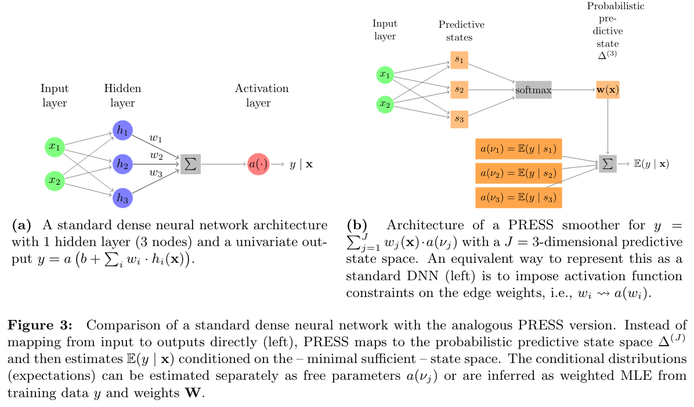

# pypress: Predictive State Smoothing (PRESS) in Python (`tf.keras`)


[](http://makeapullrequest.com)
[](https://opensource.org/licenses/Apache-2.0)

Predictive State Smoothing (PRESS) is a semi-parametric statistical machine learning algorithm
for regression and classification problems. `pypress` is using TensorFlow Keras to implement 
the predictive learning algorithms proposed in


* Goerg (2018) *[Classification using Predictive State Smoothing (PRESS): A scalable kernel classifier for high-dimensional features with variable selection](https://research.google/pubs/pub46767/)*.

* Goerg (2017) *[Predictive State Smoothing (PRESS): Scalable non-parametric regression for high-dimensional data with variable selection](https://research.google/pubs/pub46141/).*

See [below](#nutshell) for details on how PRESS works in a nutshell.


# Installation

It can be installed directly from `github.com` using:
```
pip install git+https://github.com/gmgeorg/pypress.git
```


# Example usage

PRESS is available as 2 layers that need to be added one after the other; alternatively
there is a `PRESS()` wrapper feed-forward layer that applies both layers at once.


```python
from sklearn.datasets import load_breast_cancer
import sklearn
X, y = load_breast_cancer(return_X_y=True, as_frame=True)
X_s = sklearn.preprocessing.robust_scale(X)  # See demo.ipynb to properly scale X with train/test split


import tensorflow as tf
from pypress.keras import layers
from pypress.keras import regularizers

mod = tf.keras.Sequential()
# see layers.PRESS() for single layer wrapper
mod.add(layers.PredictiveStateSimplex(
            n_states=6,
            activity_regularizer=regularizers.Uniform(0.01),
            input_dim=X.shape[1]))
mod.add(layers.PredictiveStateMeans(units=1, activation="sigmoid"))
mod.compile(loss="binary_crossentropy",
            optimizer=tf.keras.optimizers.Nadam(learning_rate=0.01),
            metrics=[tf.keras.metrics.AUC(curve="PR", name="auc_pr")])
mod.summary()
mod.fit(X_s, y, epochs=10, validation_split=0.2)
```

```
Model: "sequential_12"
_________________________________________________________________
 Layer (type)                Output Shape              Param #
=================================================================
 predictive_state_simplex_1  (None, 6)                186
 1 (PredictiveStateSimplex)

 predictive_state_means_11 (  (None, 1)                6
 PredictiveStateMeans)

=================================================================
Total params: 192
Trainable params: 192
Non-trainable params: 0
```


See also the [`notebook/demo.ipynb`](notebooks/demo.ipynb) for end to end examples for PRESS regression and classification models.


# PRESS in a nutshell <a name="nutshell"/>

Figure below from Goerg (2018) illustrates the difference between a standard feed-forward DNN and the PRESS version of it.


For prediction problems we are interested in learning the conditional distribution (expectation) p(y | X) (E(y | X)). 
In standard feed-forward neural networks, the network estimates
E(y | X) by directly mapping X to its output through a (highly) non-linear function (Fig 3a above). 

PRESS decomposes the predictive distribution first into a particular type of mixture distribution over so-called *predictive states*, that has the property that conditioned 
on the predictive state, the outputs are conditional independent of the features given their state.


where the second equality follows from conditional independence of y and X given state j.

The advantage of this decomposition is that the predictive states are the minimal sufficient statistic for predicting y, ie it is an optimal summary of the features that has best compression of information to predict y.  A by-result of this learning setup is that once the mapping from features X to predictive state simplex has been learned, the predictive states can be used to cluster observations in the predictive state space. Observations with the same (similar) predictive state have the guaranteed property that they have the same (similar) predictive
distribution for y.  For more details see papers referenced above and references therein.

PRESS is similar to [mixture density networks (MDN)](https://publications.aston.ac.uk/id/eprint/373/1/NCRG_94_004.pdf), however, because of conditional independence of outcome (y) and features (X), conditioned on the predictive states (S), the output mean predictions in PRESS are not functions of the features directly, but only are only conditioned on their predictive state.


## License

This software is licensed under Apache 2.0.