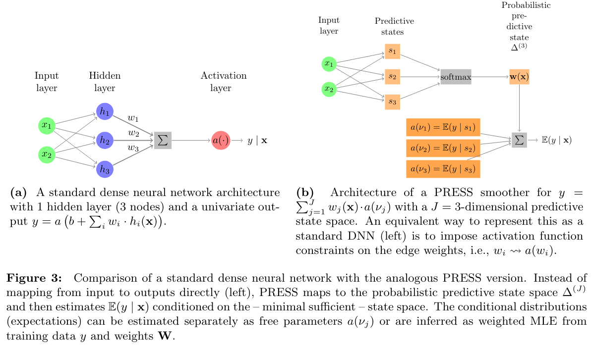

# pypress: Predictive State Smoothing (PRESS) in Python (`tf.keras`)


[](http://makeapullrequest.com)
[](https://opensource.org/licenses/Apache-2.0)


Predictive State Smoothing (PRESS) is a semi-parametric statistical machine learning algorithm
for regression and classification problems. `pypress` is using TensorFlow Keras to implement
the predictive learning algorithms proposed in

* Goerg (2018) *[Classification using Predictive State Smoothing (PRESS): A scalable kernel
  classifier for high-dimensional features with variable
  selection](https://research.google/pubs/pub46767/)*.

* Goerg (2017) *[Predictive State Smoothing (PRESS): Scalable non-parametric regression for
  high-dimensional data with variable selection](https://research.google/pubs/pub46141/).*

See [below](#press-in-a-nutshell) for details on how PRESS works in a nutshell.

## Installation

It can be installed directly from `github.com` using:

```bash
pip install git+https://github.com/gmgeorg/pypress.git
```

## Example usage

PRESS is available as 2 layers that need to be added one after the other; alternatively
there is a `PRESS()` wrapper feed-forward layer that applies both layers at once.

```python
from sklearn.datasets import load_breast_cancer
import sklearn
X, y = load_breast_cancer(return_X_y=True, as_frame=True)
X_s = sklearn.preprocessing.robust_scale(X)  # See demo.ipynb to properly scale X with train/test


import tensorflow as tf
from pypress.keras import layers
from pypress.keras import regularizers

mod = tf.keras.Sequential()
# see layers.PRESS() for single layer wrapper
mod.add(layers.PredictiveStateSimplex(
            n_states=6,
            activity_regularizer=regularizers.Uniform(0.01),
            input_dim=X.shape[1]))
mod.add(layers.PredictiveStateMeans(units=1, activation="sigmoid"))
mod.compile(loss="binary_crossentropy",
            optimizer=tf.keras.optimizers.Nadam(learning_rate=0.01),
            metrics=[tf.keras.metrics.AUC(curve="PR", name="auc_pr")])
mod.summary()
mod.fit(X_s, y, epochs=10, validation_split=0.2)
```

```text
Model: "sequential_12"
_________________________________________________________________
 Layer (type)                Output Shape              Param #
=================================================================
 predictive_state_simplex_1  (None, 6)                186
 1 (PredictiveStateSimplex)

 predictive_state_means_11 (  (None, 1)                6
 PredictiveStateMeans)

=================================================================
Total params: 192
Trainable params: 192
Non-trainable params: 0
```

See also the [`notebook/demo.ipynb`](notebooks/demo.ipynb) for end to end examples for PRESS
regression and classification models.

## Regularizers

PRESS regularizers attach as the `activity_regularizer` of `PredictiveStateSimplex`, so they
see the batch of state probabilities `W` (rows sum to 1) and penalize summary statistics of it.
Each one controls a different thing, and knowing what each sees at initialization is what makes
them tunable:

| Regularizer | Controls | Value at init (uniform weights) |
| --- | --- | --- |
| `TargetEntropy` / `Uniform` | How sharp each *row* is — one observation's state assignment | mean row entropy `= log(K)`, the maximum |
| `StateSizeEntropy` | Whether state usage is spread across all states, population-wide | penalty `= 0` |
| `MinStateSize` | A per-state floor: "at least x% of observations per state" | penalty `= 0` |
| `DegreesOfFreedom` | Effective number of states, via the kernel trace | `trace(K) = 1`, **not** `n_states` |

Three consequences worth internalizing:

* **`trace(K)` starts at 1 and grows.** At initialization every row is identical, so the kernel
  is rank one no matter how many states you asked for. A `DegreesOfFreedom` target below
  `n_states` therefore *caps differentiation from the first step* rather than pruning states
  later. If you want a small model, reduce `n_states`; use `DegreesOfFreedom` to prune once
  states mean something.
* **`StateSizeEntropy` and `MinStateSize` are free at initialization.** They start satisfied and
  only bite once mass is actually lost, so they act as guards and need no warm-up.
* **`Uniform` and `DegreesOfFreedom` cannot see a dead state.** A `K = 50` model with 45 states
  at ~0 population weight has the same kernel trace and mean row entropy as an honest `K = 5`
  model. That is what `StateSizeEntropy` / `MinStateSize` are for.

### Recommended setup

```python
from pypress.keras import callbacks, layers, regularizers, schedules

n_states = 9
epochs = 40

reg = regularizers.CombinedRegularizer([
    # Guard: no state may hold less than 5% of the population.
    # Zero at init, so full strength from epoch 0 -- it only bites if mass is lost.
    (regularizers.MinStateSize,
     {"l2": 5.0, "min_share": 0.05, "ema_decay": 0.95}),

    # Complexity: let states differentiate first, then prune toward 4 effective states.
    # Warmed up from 0, because trace(K) starts at 1 and must be allowed to grow.
    (regularizers.DegreesOfFreedom,
     {"l2": schedules.ScheduledValue(start=0.0, end=2.0, duration_epochs=epochs // 2),
      "target": 4.0, "ema_decay": 0.95}),
])

model = tf.keras.Sequential([
    tf.keras.layers.Input(shape=(X.shape[1],)),
    layers.PRESS(units=1, n_states=n_states,
                 predictive_state_simplex_kwargs={"activity_regularizer": reg}),
])
model.compile(loss="mse", optimizer=tf.keras.optimizers.Nadam(learning_rate=0.01))
model.fit(X, y, epochs=epochs, batch_size=256,
          callbacks=[callbacks.RegularizerScheduler()])   # required for the schedule
```

### Choosing `l2`

Every penalty here is bounded in `[0, l2]` and scale-invariant in `K`, so **`l2` is the
worst-case cost of total violation** and is directly comparable to your loss. Pick it as a
meaningful fraction of the loss you actually see: with a standardized target (MSE ~ 1 at init),
`l2` of roughly 1-5 makes `MinStateSize` bind, while `l2 = 0.05` leaves it decorative. Because
of the `K`-normalization, a value tuned at one `n_states` carries over to another.

### Which knobs to schedule, and in which direction

Direction is expressed by the endpoints — `start < end` warms up, `start > end` decays — and it
differs per regularizer, so do **not** ramp them all together.

| Regularizer | Schedule | Why |
| --- | --- | --- |
| `DegreesOfFreedom` | `l2`: `0 -> target strength` | `trace(K)` starts at 1; let it grow on the fit signal, then prune |
| `DegreesOfFreedom` | `target`: `n_states -> desired` (alternative) | More aggressive: forces differentiation first, then prunes gradually |
| `TargetEntropy` | `entropy_fraction`: `1.0 -> desired` | Row entropy starts at `log(K)`, i.e. fraction 1.0 — starts the constraint where the model already is |
| `MinStateSize` | none (constant `l2`) | Already satisfied at init; it is the counterweight during the fragile early epochs |
| `StateSizeEntropy` | none (constant `l2`) | Same |

Any scalar accepts a `ScheduledValue` (`l2`, `target`, `entropy_fraction`, `active_fraction`,
`min_share`), with `linear`, `cosine` or `exponential` interpolation.

`RegularizerScheduler` must be passed to `fit` for a schedule to advance. If you forget it, a
`ScheduledValue` stays at its `end` value, so you get the fully enforced penalty with no
annealing — never a silently disabled regularizer.

### Batch size and `ema_decay`

The state-size marginal and the kernel trace are estimated from a single minibatch, and every
penalty is convex in them, so each batch estimate is biased *upward*. Running more batches per
epoch does not remove that bias — only a larger batch, or `ema_decay`, does. With a population
that exactly meets a 5% floor (true penalty 0), the mean `MinStateSize` penalty at
`batch_size=32` is 0.052 whether averaged over 200 or 5000 batches, and a compliant state is
flagged in ~82% of batches; the effective floor is then well above the one you asked for.

Either keep `batch_size * min_share` at roughly 10 or more (so `batch_size >= 200` for a 5%
floor), or set `ema_decay` (0.9-0.99), which smooths the statistics across batches while
gradients still flow through the current batch.

## PRESS in a nutshell

The figure below, adapted from **Goerg (2018)**, contrasts the architecture of a standard
feed-forward Deep Neural Network (DNN) with the **Predictive State Smoothing (PRESS)** approach.



### 1. Standard Feed-Forward DNNs

In typical prediction problems, our goal is to model the conditional distribution $p(y \mid X)$
or the conditional expectation $E[y \mid X]$. A standard feed-forward network estimates this by
directly mapping features ($X$) to an output through a series of highly non-linear
transformations (as seen in Figure 3a).

### 2. The PRESS Decomposition

In contrast, PRESS decomposes the predictive distribution into a mixture distribution over
**predictive states** ($S$). This architecture relies on a critical property: conditioned on a
predictive state $j$, the output ($y$) becomes conditionally independent of the input features
($X$).

Mathematically, this is expressed as:


The second equality holds because the state $j$ captures all relevant information from $X$
necessary to predict $y$, rendering the raw features redundant once the state is known.

### 3. Key Advantages and Clustering

The primary strength of this decomposition is that predictive states serve as **minimal
sufficient statistics** for $y$. They provide an optimal informational summary—maximizing
compression while retaining full predictive power.

An important byproduct of this framework is the ability to perform **predictive clustering**:

* Once the mapping from features ($X$) to the predictive state simplex is learned, observations
  can be clustered within the state space.
* Observations sharing similar predictive states are guaranteed to have similar predictive
  distributions for $y$, providing a principled way to group data based on future outcomes
  rather than raw input similarity.

### 4. Comparison to Mixture Density Networks (MDN)

While PRESS shares similarities with [Mixture Density Networks
(MDN)](https://publications.aston.ac.uk/id/eprint/373/1/NCRG_94_004.pdf), there is a fundamental
distinction. In an MDN, the output parameters are often direct functions of the features. In
**PRESS**, the conditional independence of $y$ and $X$ given $S$ ensures that the output means
are conditioned *only* on the predictive state, not the raw features.

## License

This project is licensed under the terms of the MIT license. See
[LICENSE](https://github.com/gmgeorg/pypress/blob/main/LICENSE) for additional details.
